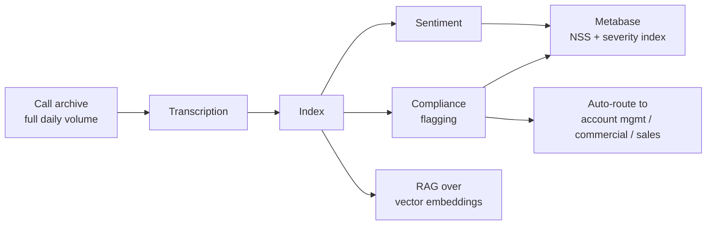
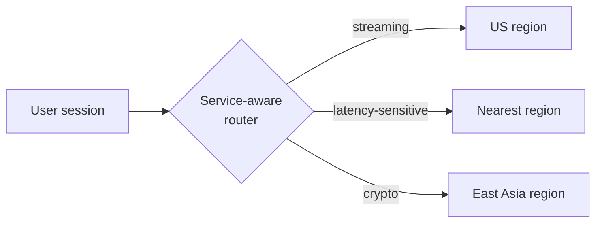

<div align="center">

# Sajad Roudbari

**`Forward Deployed Engineer`** &nbsp;•&nbsp; **`Solutions Architect`**

<samp>I get access. I ship. I keep it running.</samp>

<br>

[](https://iamsajaad.com)
[](https://linkedin.com/in/iamsajaad)
[](mailto:hi@iamsajaad.com)

<sub>📍 Tehran, Iran &nbsp;·&nbsp; ✈️ Open to relocation &nbsp;·&nbsp; 🗣️ Persian · English</sub>

</div>

---

> [!NOTE]
> **I go into messy environments, get access, ship working systems end to end, and then run them in production.**
> Analytics platforms, LLM pipelines, payment integrations. Most of what I have shipped started as a problem nobody owned, with no mandate to fix it.

<br>

## 🧠 &nbsp;Call intelligence at Digikala

Quality control ran on a **random 10% sample** of call-centre calls, and escalation was how anything outside that sample got found. I negotiated archive access out of the company's most regulation-bound data team, then built a pipeline over the **full daily volume**.



<table>
<tr>
<td width="33%" align="center"><h3>−40%</h3><sub>manual support escalations<br/>in three months</sub></td>
<td width="33%" align="center"><h3>10% → 100%</h3><sub>call coverage<br/>replacing random sampling</sub></td>
<td width="33%" align="center"><h3>2</h3><sub>new metrics ops teams<br/>now run on</sub></td>
</tr>
</table>

<sub>`n8n on Kubernetes` · `cost-guarded model router` · `ClickHouse` · `Metabase` · `Python`</sub>

<br>

## 📡 &nbsp;Zonerift &nbsp;<sub><sup>built and operated solo</sup></sub>

Most privacy tools push all traffic through one exit IP, so you trade speed for reach. This one decides **per service**, and switches mid-session without dropping the connection.



<table>
<tr>
<td width="33%" align="center"><h3>~1.5 PB</h3><sub>per month</sub></td>
<td width="33%" align="center"><h3>99.9%</h3><sub>uptime, effectively<br/>unattended</sub></td>
<td width="33%" align="center"><h3>18</h3><sub>AWS regions<br/>via Ansible</sub></td>
</tr>
</table>

<details>
<summary><b>How it holds together</b></summary>

<br>

WireGuard across 18 AWS regions, provisioned with Ansible so every region stays in sync from one source of truth. PostgreSQL for accounts, Redis for licence checks and live usage, both behind a Python REST API.

Billing has no third-party provider: **10+ fiat and crypto rails**, plus a Telegram bot handling subscriptions and renewals. Health and status through uptime kuma and instatus.

AWS funded the first year of infrastructure.

</details>

<sub>`WireGuard` · `Ansible` · `AWS` · `PostgreSQL` · `Redis` · `Python` · `Traefik`</sub>

<br>

## 📊 &nbsp;Self-hosted analytics, rebuilt from zero

Google Analytics deleted the workspace with no warning, and there was no budget for a commercial replacement.

```
     event taxonomy         →  reconstructed from scratch
     4 platforms            →  tested against production traffic
     PostHog                →  forked, patched, load spread over ClickHouse
     Rybbit under Coolify   →  where it landed
```

<sub>`ClickHouse` · `Next.js` · `Python` · `BigQuery` · `Coolify` · `Rybbit`</sub>

<br>

## ⚙️ &nbsp;Stack

<div align="center">


</div>

> [!IMPORTANT]
> These are tools I **run and patch in production**, not ones I only recommend. I operate them. I did not author them.

<br>

## 🌱 &nbsp;Open source

I operate a lot of it, and contribute upstream when I hit a gap worth closing.

<br>

---

<div align="center">
<sub>

Head of Product Design, Quick Commerce **@ Digikala** &nbsp;·&nbsp; Founder **@ Zonerift**

Looking for forward deployed engineering and solutions work.

</sub>
</div>
